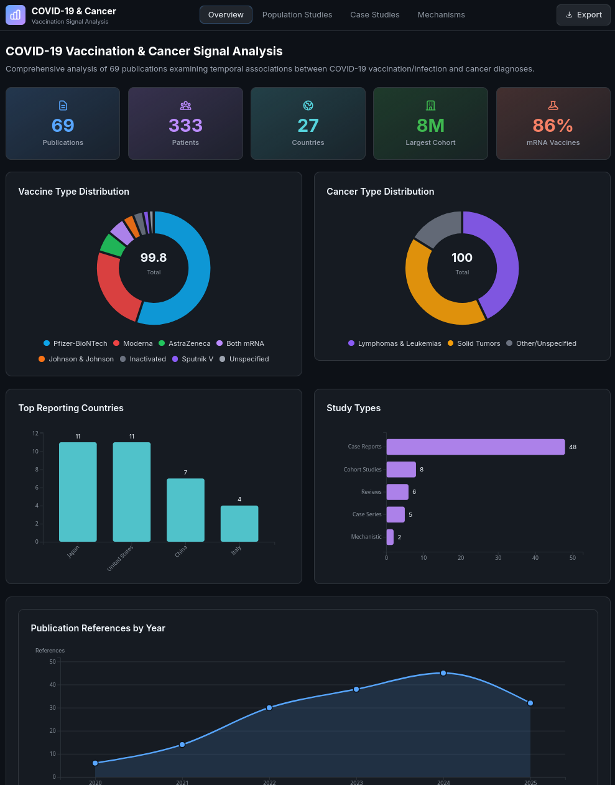
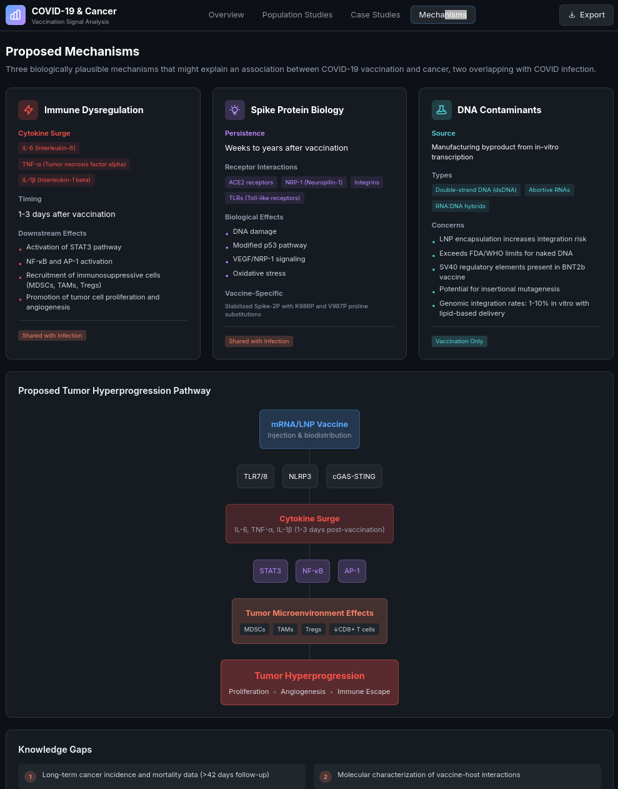
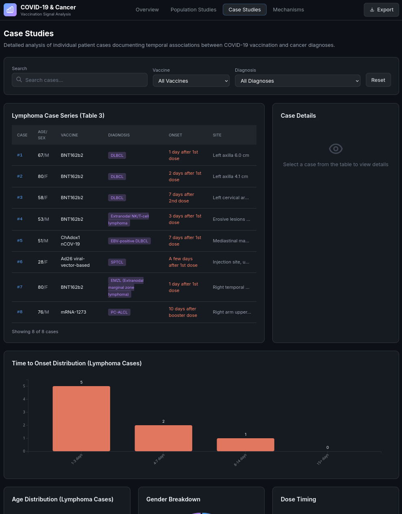
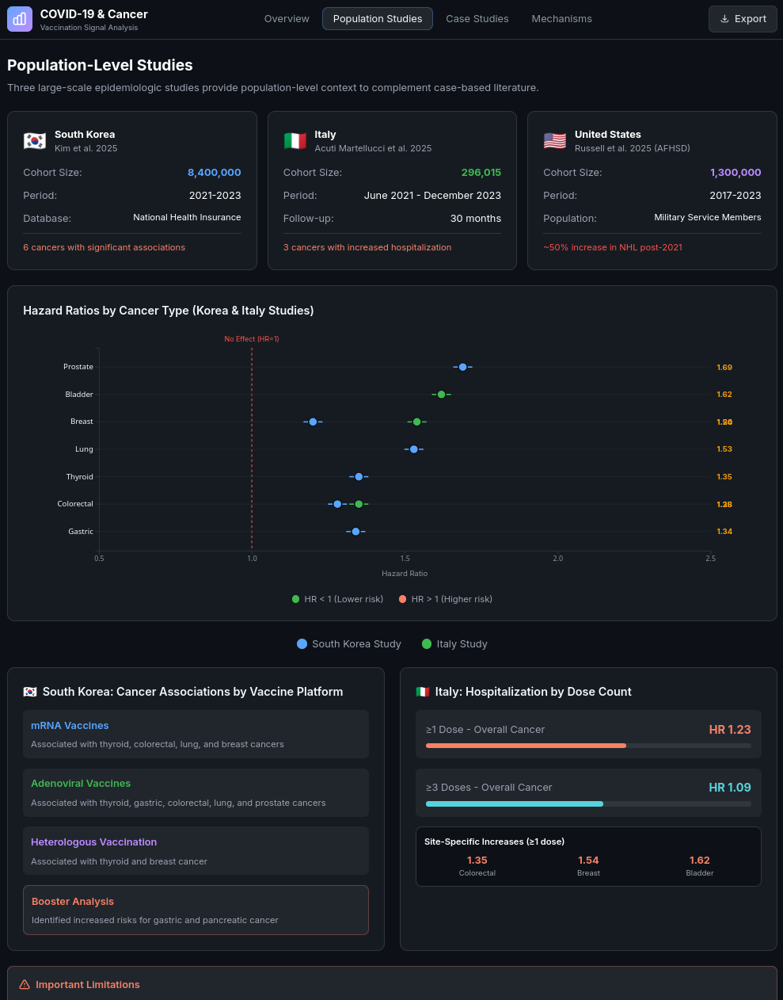

# COVID-19 Vaccination & Cancer Signal Dashboard

## Overview
This project is a React dashboard that visualizes data from the 2026 Oncotarget review "COVID vaccination and post-infection cancer signals: Evaluating patterns and potential biological mechanisms." It presents summary statistics, population-level study findings, case series details, and mechanistic hypotheses with interactive charts.

## Data Sources
- Review data extracted into `src/data/dashboard_data.json`.
- Publication reference timeline derived from the review bibliography (2020-2025).

## Pages
- **Overview**: Key statistics, vaccine distribution, cancer type mix, study types, and reference timeline.
- **Population Studies**: Hazard ratios from large cohorts (South Korea and Italy) with study context.
- **Case Studies**: Lymphoma case series table, onset timing, and demographic breakouts.
- **Mechanisms**: Proposed biological pathways and knowledge gaps.

## Screenshots





## Tech Stack
- React 19 + Vite
- D3.js for charts
- Tailwind CSS
- Framer Motion

## Getting Started
```bash
npm install
npm run dev
```

The dev server runs at `http://localhost:5173`.

## Build
```bash
npm run build
```
